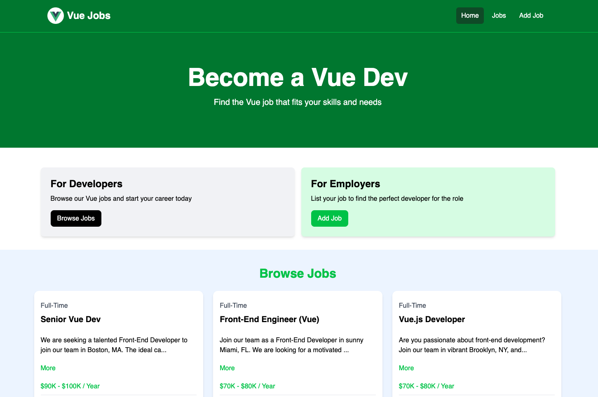

# Vue Jobs Project

A simple job listing project for learning Vue.js.



## Features
- Full CRUD application for job posts.
- Contains JSON-Server for a mock backend API and database.

## Stack used
- Vue, Vue router
- Tailwind (V4)
- Vite
- json-server

## Technique learnt
- Interpolation, Options API, Composition API
- Directives (e.g. v-if, v-on & Methods, Shorthand)
- Lifecycle Hooks (e.g. onMounted), Props, defineProps
- Router, ref, reactive ...

## Usage

```sh
npm install
```
## Run JSON Server

The server will run on http://localhost:8000

```bash
npm run server
```

### Run Vite Frontend

```sh
npm run dev
```

### Build for Production

```bash
npm run build
```

### Preview Production Build

```bash
npm run preview
```

## Credit
[YouTube](https://www.youtube.com/watch?v=VeNfHj6MhgA)
